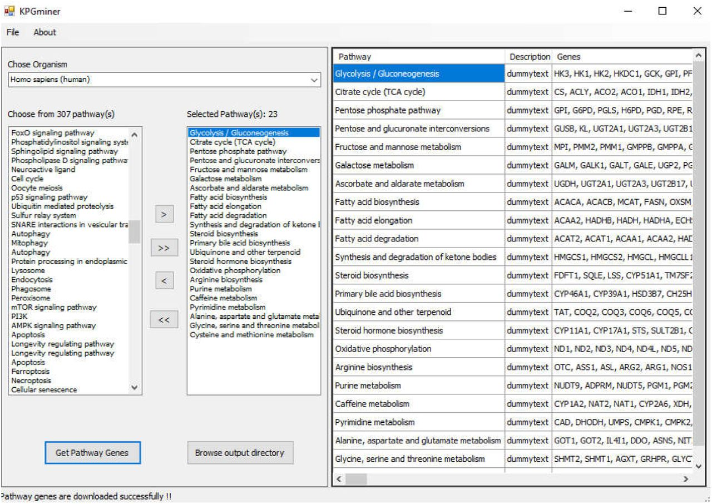

# KPGminer: a tool for retrieving pathway genes from kegg pathway database
## Introduction:
Pathway analysis is a very important aspect in computational systems biology as it serves as a crucial component in many computational pipelines. KEGG is one of the prominent databases that host pathway information associated with various organisms. In any pathway analysis pipelines, it is also important to collect and organize the pathway constituent genes for which a tool to automatically retrieve that would be a useful one to the practitioners. In this article, I present KPGminer, a tool that retrieves the constituent genes in KEGG pathways for various organisms and organizes that information suitable for many downstream pathway analysis pipelines. We exploited several KEGG web services using REST APIs, particularly GET and LIST methods to request for the information retrieval which is available for developers. Moreover, KPGminer can operate both for a particular pathway (single mode) or multiple pathways (batch mode). Next, we designed a crawler to extract necessary information from the response and generated outputs accordingly. KPGminer brings several key features including organism-specific and pathway-specific extraction of pathway genes from KEGG and always up-to-date information. Thus, we hope KPGminer can be a useful and effective tool to make downstream pathway analysis easier and faster. 

## Download [Stand-alone Tool]
KPGminer is freely available for download from https://sourceforge.net/projects/kpgminer/.

## Citation
```
@article {Azad416131,
	author = {Azad, A. K. M.},
	title = {KPGminer: A tool for retrieving pathway genes from KEGG pathway database},
	elocation-id = {416131},
	year = {2018},
	doi = {10.1101/416131},
	publisher = {Cold Spring Harbor Laboratory},
	URL = {https://www.biorxiv.org/content/early/2018/09/13/416131},
	eprint = {https://www.biorxiv.org/content/early/2018/09/13/416131.full.pdf},
	journal = {bioRxiv}
}
```
## Demo

